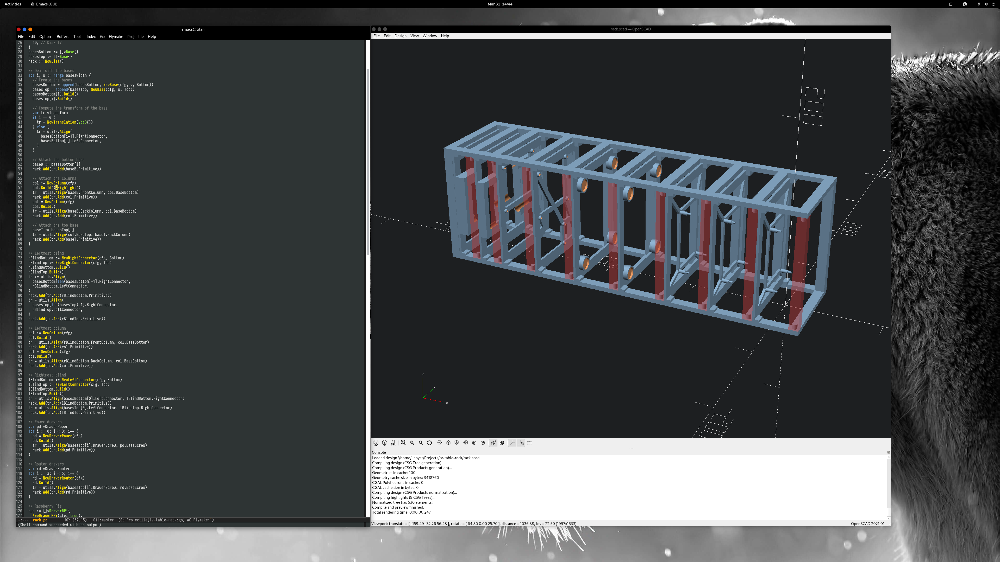

GhostSCAD
=========

GhostSCAD is a piece of software that makes it easy to create CAD models using
[Go][golang] and compile them to the [OpenSCAD][openscad] language. It allows
you to use the full power of a real programming language and use the rendering
capabilities of OpenSCAD.

It requires GO 1.17.



See the blog post explaining the motivations [here][bp] and a real-life example
[here][rack].

Example
-------

GhostSCAD aims to minimize the boilerplate but, since it uses a general purpose
programming language, there is still some. First, you need to create a Go module
for your project and add GhostSCAD to it:

    mkdir design; cd design
    go mod init example.com/design
    go get github.com/ljanyst/ghostscad

Here's an example rendering a sphere of radius 10 and producing the appropriate
OpenSCAD model in the `main.scad` file:

```golang
package main

import (
	. "github.com/ljanyst/ghostscad/primitive"
	"github.com/ljanyst/ghostscad/sys"
)

func main() {
	sys.Initialize()
	sys.RenderOne(Sphere(10))
}
```

You can generate such a minimal program by running:

    go run github.com/ljanyst/ghostscad/util/stub_generator -file-name blah.go

Here's a slightly more elaborate example:

```golang
package main

import (
	"github.com/ljanyst/ghostscad/lib/shapes"
	"github.com/ljanyst/ghostscad/sys"

	. "github.com/ljanyst/ghostscad/primitive"
)

func main() {
	sys.Initialize()
	sector := shapes.NewSector(20, 45, 135).SetFn(72).Build()
	arc := shapes.NewArc(25, 45, 290).SetWidth(2).SetFn(72).Build()
	sys.RenderMultiple([]sys.Shape{
		{"sector", sector, sys.None},
		{"arc", arc, sys.None},
		{"sector-and-arc", NewList(sector, arc), sys.Default},
	})
}
```

It imports the complex shape library provided with GhostSCAD and renders
multiple shapes. The parameter to `sys.RenderMultiple` is a slice of Shape
object. The default shape is the one being rendered to `sector-and-arc.scad`
unless the program is instructed otherwise via commandline parameters. You can
list the available shapes:

    ]==> go build
    ]==> ./sector-and-arc -list-shapes
    sector
    arc
    sector-and-arc (default)

You can render the one you like:

    ]==> ./sector-and-arc -shape arc
    ]==> ls arc.scad
    arc.scad

You can also generate the STL file directly (if it were a 3D shape) by supplying
the `-stl` parameter. Use the familiar `-help` to see all the available
parameters.

There's a whole bunch of other examples in this code repository. The author
leaves it as an exercise to the reader to find them. :)

Rendering Automation
--------------------

One of the cool features of OpenSCAD is automatic re-rendering triggered by
changes to the underlying SCAD files. Since GhostSCAD leverages the Go
programming language, it also makes sense to use it in a fully-fledged code
editor. Here's an Elisp function to compile and run the current go buffer in
[Emacs][emacs]:

```elisp
(defun go-run-this-file ()
  "go run"
  (interactive)
  (save-buffer)
  (shell-command (format "go run %s" (buffer-file-name))))
```

You can then bind it to a key combination in your `go-mode` hook like this:

```elisp
(local-set-key (kbd "C-c C-r") 'go-run-this-file)
```

After you set this up, hitting "CTRL-C CTRL-R" compbination runs the code in the
current go buffer and overwrites the `main.scad` file with the most recent
version of your model. If you have OpenSCAD rendering this file, it will redraw
your model automagically.

Happy hacking!

[golang]: https://golang.org/
[openscad]: https://openscad.org/
[emacs]: https://www.gnu.org/software/emacs/
[bp]: https://jany.st/post/2022-04-04-ghostscad-marrying-openscad-and-golang.html
[rack]: https://github.com/ljanyst/tv-table-rack
